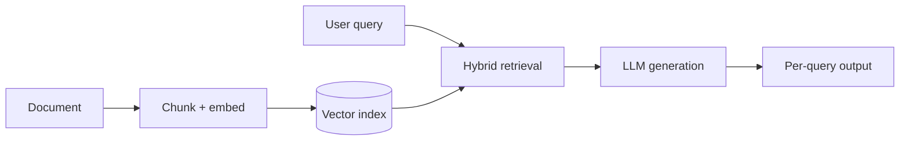

In 2018, we built a document-ingestion pipeline with NLP parsing, restructured output, and an adaptive-learning UI as part of a subscription product. We were not aware of the transformer architecture that propels the foundation models of today — BERT and the first GPT had only just shipped that year. Optey aimed to boost productivity for those unwilling to read lengthy books.  The plan was to use NLTK and Python's NLP libraries to compress those inputs into shorter page summaries that read like a story. The idea was sound, but technology at that time limited its implementation.

Fast forward to 2026, and here is how that build compares to the same system if you were to architect it today.

In 2026 terms, we had built a RAG-based adaptive-learning SaaS, before RAG had a name. The stack was modest: Python and Django on the backend, NLTK doing the parsing, an SQL store for structured records with a JavaScript frontend on top. The pipeline ran in one direction where it had documents in -> parsed once -> persisted as structured records & UI read from these records. We never finished it into a product, but eight years later, the architecture sketched is approximately the same architecture I would still draw today.

Then and now:

The point of this essay is not the project, it is the narrow question of what the model layer of a document AI system can output now that it could not output in 2018, and what that change does to the systems around it. In summary: architectural successes, strategic mistakes, and most importantly — changes to the AI layer.

## What we got right

The architectural pattern (ingest unstructured → structure → personalize) and the cognitive-science framing (ILM).

The shape of the system holds up where documents went in once, got parsed once, got persisted as structured records and the UI read from the records at request time. Modern RAG architectures feature an initial ingestion phase that creates an index, followed by retrieval and generation at query time; this design is mainly driven by economic factors.  Ingestion is expensive while queries are cheaper, hence, the RAG model because any system that doesn't separate them eats its compute budget. We got this right, whether by accident or not; Django's request lifecycle made it the obvious thing to do, and it kept being the right thing to do as the model layer changed underneath it.

The Interactive Learning Model gives a definition of good output that does not collapse into fluent text. Useful output for a learner has three dimensions: what they think, what they decide to do, and how they feel. Designing the output schema around that triad forced the system to produce more than just summaries; it had to produce prompts where reflective questions are tied to specific sections based on user committed to a next action. In 2018 that was scaffolding around mediocre NLTK output, an attempt to make the surface feel less mechanical. In 2026 the same schema is what you would put in a system prompt with structured-output enforcement. The pedagogical theory was doing the work that schema-constrained generation does today — just by hand and in a database table.

The third thing we got right was treating the output as a recurring product rather than a one-time artifact. Subscription billing encourages retention-focused workflows, which are essential for the lasting value of a document AI system.  The model produces text. The product is what surrounds the text: how the user moves through it, returns to it, and builds on it. In 2018, this looked like a UX consideration. In 2026, it looks like the only part of the stack that isn't commoditized.

## What we missed

We missed the scale of foundation models, embedding based retrieval, and the rapid commoditization of the AI layer relative to workflow and UX. All three misses boil down to a misunderstanding of what the model layer would ultimately be able to do.

NLTK is a tokenizer and POS tagger: it can label “the cat sat on the mat” as a noun phrase plus a prepositional phrase, but it does not understand cats, mats, or sitting. Our summarization was therefore extractive—ranking sentences with TF IDF and stitching them together. That is compression, not understanding. Moving from extractive to abstractive output required transformers, introduced in 2017 and not usable at scale until GPT 3 in 2020. We were building on a substrate that was about to be obsolete, a fact known to only a small group of researchers at the time.

Retrieval was the bigger miss. We built a parser, not a retriever. The whole system assumed there was one canonical structured form of each document, produced at ingest time, and the UI surfaced different views of that one form. The 2026 version of the same system would not work that way. It would store the document as a vector index — chunks of text mapped into a high-dimensional space where semantic similarity is computable — and produce a tailored output every time the user asked something different about the same source. The structure is no longer the answer. The structure is the search space. The answer gets generated at query time, against the part of the search space the question pointed at. That distinction sounds small, but it is the entire shift from 2018 document AI to 2026 document AI.

The third miss took years to understand and is the strategic one. We assumed the rule-based NLTK techniques — parsing and summarization of text — were the moat. If we could build a better summarizer than the open-source baseline, we would have something defensible. What happened is that AI innovation with transformer architecture and foundation models commoditized faster than anything else in the stack. Summarization is an API call. Embedding is an API call. Cross-document synthesis is an API call. Complex reasoning with lengthy documents is just an API call, charged per token at minimal cost.  The model layer collapsed from "the hardest part to build" to "the easiest part to call." Everything we thought was the differentiator is now a few lines of Python. The defensible parts of the system in 2026 are nothing we would have flagged as defensible in 2018: the curation of the source corpus, the trust UI around hallucinations, the integrations, the workflow that turns a model output into a learning loop. The model is the substrate, not the product.

## How the AI layer changed

This is the part I came here to write. Not the AI revolution — the narrow, specific question: if you sat down to build the same kind of document AI system today, with long-document ingestion, structured output, and an adaptive-learning UI, what would the model layer give you that NLTK didn't? What would be different if you were to do it today?

### Output shape is no longer fixed at ingest time

This is the deepest change. In 2018 the output was determined when the document was parsed. We produced a fixed set of structured records — sections, summaries, key terms, question banks — and rendered different views of that fixed set. If a user wanted to ask something the schema didn't anticipate, the system had no answer; it would fall back to keyword search at best.

Modern document AI works on the inverse principle: the ingestion stage produces an index, not an answer. Output is generated per query, against the relevant chunk of the index, with the model deciding what shape the answer should take. The same source yields a one-paragraph summary, a multi-step explanation, a comparison table, a worked example, a tutorial, or a flashcard set, depending on what the user asks for. The schema moved from compile time to runtime. That is a much bigger change than it sounds.

### Extractive versus abstractive collapsed

Extractive summarization — picking the most informative sentences from the source — was the safe choice in 2018, because the alternative produced a salad of words. Abstractive summarization, where the system writes its own sentences, required generative models we did not have at the time.

By 2022 the tradeoff had inverted. Abstractive output was higher quality than extractive on most dimensions that mattered: coherence, adaptation to the reader's level, ability to compress redundant material, ability to surface implications the source didn't state directly. The cost of this shift is hallucination — the model invents content that wasn't in the source. Mitigating it required grounding: forcing the model to cite source spans, rejecting outputs whose claims don't appear in retrieved context, running consistency checks across multiple model passes. The grounding loop is now standard infrastructure for most commercial AI systems. It wasn't a category in 2018.

### Multi-document synthesis became a primitive

A 2018 system that wanted to compare two textbooks on the same topic had to build that logic explicitly. Entity alignment. Claim extraction. Contradiction detection. Each one its own research project, and the combined pipeline was brittle. A 2026 system passes both texts to the model with a query like "where do these disagree, and on what evidence?" and gets back a coherent answer with citations. The work that used to take a team-year of NLP engineering is a prompt.

This generalizes well past summarization. Tasks that once needed specialized NLP tools, as an example: entity resolution, sentiment analysis, and topic modeling etc., are now handled zero-shot by general-purpose models, often without any prompt engineering.  The specialist NLP toolkit that dominated this domain for two decades has been largely absorbed into the foundation model, that absorption was not predicted and was not gradual.

### Multimodal input is no longer a separate pipeline

In 2018, document AI with Optey meant text. Diagrams, charts, equations, tables embedded as images, scanned pages, handwritten margin notes — these all required separate OCR, layout analysis, and figure-understanding pipelines. Most projects skipped them; the engineering cost was too high relative to the ROI, especially given OCR was unreliable and figure understanding barely worked.

Modern multimodal models ingest a PDF page as an image and answer questions about its contents directly — diagrams, formulas, the relationship between a chart's y-axis and its caption, all of it. This unification matters beyond convenience. It removes a class of failure mode where the most semantically important content in a document — the figure that shows the relationship the text is describing — was invisible to the system because it lived in pixels rather than tokens. A 2018 document AI system was illiterate in half of what it ingested. A 2026 system isn't.

### Output is no longer one-shot

A 2018 pipeline ran once and emitted an answer; if it was wrong, the user had to rerun the entire process. A 2026 system actively improves its own output while asking clarifying questions, pulling more context, running calculations, or refusing to guess when information is missing. The distinction between output and session is gone. What the user gets is the result of an internal, multi step process, not a single forward pass. Call it agentic or tool using if you want—the reality is that the system now thinks before it answers, and that reasoning is visible, inspectable and can be debugged.

## What hasn't changed

What hasn’t changed matters more than what has. Document AI still requires a structured intermediate representation, and it still requires a workflow layer that turns model output into something a user can act on. Corpus quality remains the hardest constraint—and it has become more dangerous rather than less. More capable models are more sensitive to bad input and will confidently produce fluent, plausible, wrong answers. In 2018, a noisy corpus yielded visibly broken output, which forced correction. In 2026, the same corpus yields polished, coherent errors it is possible those errors ship.

AI models improved dramatically, however, the engineering around them became even more important. I assumed better models would simplify the system. The opposite happened. Modern document AI systems are larger and more complex, with additional components, guardrails, retrieval layers, evaluation pipelines, and agentic loops. The model is no longer the system; it is one node in an increasingly complex graph.

That is the part I would explain to the 2018 version of myself, if I could: the AI model improving by a huge magnitude does not collapse the system around it; it expands the system. Mediocre models force simple architectures because nothing else works. Capable models force complex architectures because they make ambitious products possible, and ambitious products have surface area.

<figure class="my-8">
  <video
    controls
    preload="metadata"
    class="w-full rounded-md border border-[var(--color-border)]"
  >
    <source src="/video/document-ai-retrospective.mp4" type="video/mp4" />
    Your browser does not support the video tag.
  </video>
</figure>
