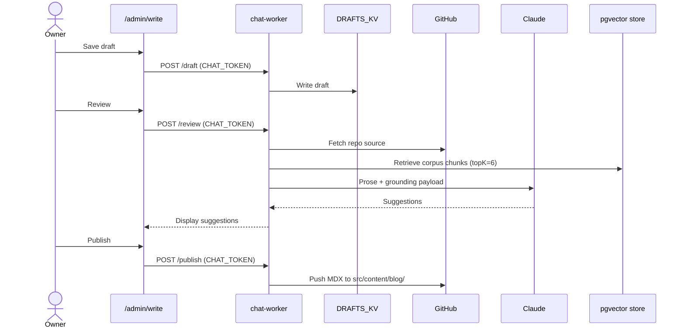

I've been rebuilding my personal site for a couple of weeks. This post is about one specific feature: a writing editor that lets me draft a post, get it reviewed by Claude against my actual code and docs, and publish directly to sajivfrancis.com — all without leaving the browser. Drafts live in Cloudflare KV — `DRAFTS_KV`, owner-only behind CHAT_TOKEN. Once published, only the final version goes to GitHub; the site builds from there.

Here's the loop. One Cloudflare Worker — the chat-worker — handles all read/write to DRAFTS_KV, owner-only access enforced by CHAT_TOKEN.

```mermaid
flowchart TD
    A[/admin/write] -->|Save| B[DRAFTS_KV<br>owner-only via CHAT_TOKEN]
    B -->|Publish| C[GitHub: src/content/blog/<br>YYYY-MM-DD-slug.mdx]
    C -->|git push| D[GitHub Pages rebuild]
    D --> E[sajivfrancis.com/blog/slug]
``` 

The review pass fetches the actual GitHub source for any repo I tag, then asks Claude to ground my prose against that code. If I write "I used Python" but 'wrangler.toml' says TypeScript, the suggestion flags it — I fix it manually before publishing.

This is a different way of writing. Review prose and technical claims in the same pass — fix what's flagged, ground the build details against the actual repo, publish. The corpus grounding goes further: retrieval pulls from docs.sajivfrancis.com and the pgvector store, so I can cross-check a new post against everything I've already written and documented.

| Component | Role | Access |
|---|---|---|
| `/admin/write` | Browser editor UI | Owner-only (CHAT_TOKEN) |
| `chat-worker` | Draft read/write to KV | Owner-only (CHAT_TOKEN) |
| `DRAFTS_KV` | Cloudflare KV draft store | Private binding |
| GitHub repo | Published MDX + images | Public on push |
| pgvector store | Corpus chunk retrieval (topK: 6) | Owner-only (CHAT_TOKEN) |
| Claude | Prose + technical review | Called by chat-worker |



The retrieval query is constructed from the draft's title and the first 800 characters of the body — enough signal to surface relevant chunks without overfitting to the opening paragraph. The actual call looks like this:

```ts
// pgvector corpus grounding — use draft title + body lead as the
// retrieval query. Owner mode so all visibility scopes are in play.
let corpusChunks = [];
const retrievalQuery = `${draft.frontmatter.title}\n\n${draft.body.slice(0, 800)}`;
try {
  const ctx = await getContext(
    retrievalQuery,
    ['docs', 'writing', 'meta'],   // ← topic filters
    undefined,                       // owner → no visibility filter
    'owner',
    clientId,
    env,
    { topK: 6 }                      // ← matches topK in component table
  );
  corpusChunks = ctx.chunks ?? [];
} catch (e) {
  // Non-fatal — continue with GitHub grounding only
}
```

The AI layer is only as useful as its grounding — GitHub source, personal docs, the vector store. Strip that away and it is just a grammar checker.
