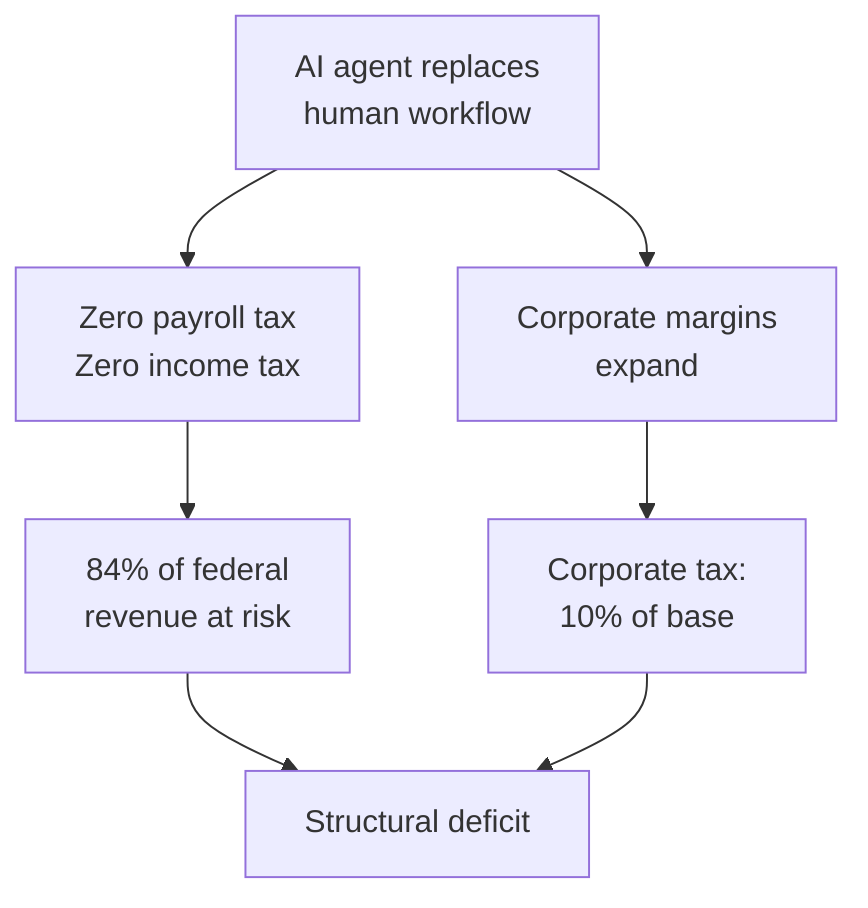

The global AI market is worth roughly $3.19 trillion while most of it isn't coming from consumers.

While 500 million households might collectively spend roughly $600B annually on AI subscriptions and hardware, corporate infrastructure dwarfs that entirely. A single large enterprise spends an average of $2.8M a year on AI compute and fine-tuning, in comparison, that requires around 2300 premium consumer households to match one corporation's footprint. The U.S. alone commands 55% of all global B2B AI spend mainly driven by hyper-scalers building out the infrastructure layer.

Corporations are chasing a 3-to-1 ROI on AI automation. High-maturity firms aren't deploying chatbots, they're deploying autonomous agents that permanently retire human workflows. The jobs don't get cut visibly; they simply stop being hired. The entry-level ladder quietly disappears.

Are governments structurally prepared for this?

In the U.S., 84% of federal revenue is tied directly to human labor through a combination of income and payroll taxes. When an AI agent replaces a human workflow, that revenue drops to zero. The agent pays no FICA, no Medicare, no income tax. Even if corporate margins explode, corporate tax is only 10% of the federal revenue base, the math doesn't recover.

The optimist's answer is post-scarcity abundance makes taxation obsolete while it ignores the 20-year transition gap where social safety nets still need funding.

Three practical interventions exist:

- **Compute tax** — taxing GPU cycles the way we tax payroll.
- **Sovereign wealth dividends** — forcing a percentage of AI profits into state-managed funds that pay citizens directly.
- **Human-in-the-loop tax incentives** — rewarding augmentation, penalizing full automation.

The AI boom won't fail because it's inefficient, it may fail because it's too efficient while optimizing the economy for a consumer base that can no longer afford to consume.

Full analysis, data tables, and the spend matrix breakdown are in the whitepaper @ https://docs.sajivfrancis.com/ai/document-intelligence/the-ai-economic-trap-when-corporate-efficiency-meets-fiscal-reality/#context-the-100-household-experiment
