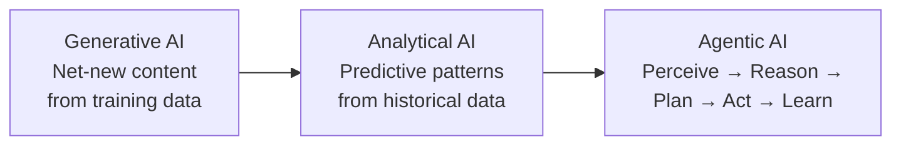
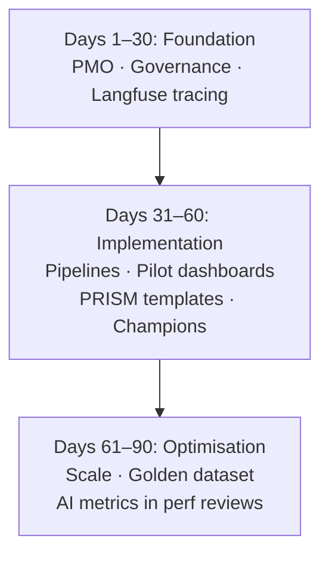

Executive Brief: Driving AI Transformation Through Strategic Leadership

1. Navigating the AI Landscape: The Agentic Shift
My time at the Stanford AI-Driven Leadership Program reinforced something I already suspected: the organisations that get this right are not treating AI as a static implementation — they are building for continuous adaptation. This requires understanding the evolving AI continuum:
**Generative AI** — produces net-new content based on patterns learned from training data.
**Analytical AI** — extracts predictive patterns and forecasts outcomes from historical data.
**Agentic AI** — executes continuous loops of perceiving, reasoning, planning, acting, and learning to automate cross-system workflows.
Scaling these technologies requires a three-part framework — **Framing** (aligning initiatives with corporate identity and human empowerment), **Structuring** (designing workflows, centralising data units, and assigning accountability), and **Evaluating** (establishing continuous feedback loops, strict data governance, and clear ROI metrics).

2. Structural Agility: Flash Teams & Org Chart Adjustments
Real AI capability requires structural transformation — moving away from traditional, siloed hierarchies.
The Framework: Transitioning toward highly flexible, cross-functional Flash Teams—temporary, agile groups rapidly assembled to execute high-impact projects—supported by permanent Organisational Chart Adjustments that embed AI and data science units centrally.
The Blueprint (Stitch Fix Case Study): Elevating data science teams to report directly to executive leadership grants them the autonomy to drive enterprise-wide innovation rather than narrow functional goals. This reshapes work practices, professional identities, and cross-functional collaboration.
The Application (SAP Joule Copilot Scenario): Implementing conversational, transactional, and informational tools like SAP Joule is a leadership effort, not just a technical deployment. It succeeds by framing the tool as user empowerment, deploying flash teams to accelerate agile development (e.g., via SAP Build Code), and maintaining strict human-in-the-loop governance.

3. Workflow Integration: Overcoming the AI Implementation Gap
Technical excellence alone does not guarantee business adoption. As highlighted by MIT Technology Review’s analysis of failed clinical pandemic models, AI initiatives frequently collapse due to a disconnect between data teams and real-world operational environments.
To bridge this gap, leadership must prioritize process over speed across two core enterprise data streams:
A. Analytical AI for Financial Operations (Structured Data)
The Opportunity: Automating manual anomaly detection within financial modules (e.g., SAP S/4HANA FI/CO, Snowflake, Databricks) to shift from reactive variance analysis to proactive financial control.
Business Impact: Near real-time anomaly alerts (dropping from a 24–48 hour delay), a 10–15% improvement in detection accuracy, and up to 20 analyst hours saved per week during critical close periods.
B. Generative AI & Model Evaluation (Unstructured Data)
The Opportunity: Managing and evaluating the cost, performance, and hallucination risks of multiple LLMs deployed across enterprise applications.
The Solution: Utilizing a self-hosted Langfuse Observability Platform to systematically evaluate models against a standardized rubric (relevance, correctness, helpfulness, and hallucinations).
The Benchmarking Verdict: Based on production telemetry, Anthropic Claude 4.5 Sonnet stands out as the optimal "LLM-as-a-judge" for high-stakes evaluations and complex multimodal prompts, outperforming GPT-4o in quality metrics by 7-12%. Meanwhile, GPT-4o remains the fast, cost-effective workhorse for bulk content generation.

4. The 90-Day Execution Roadmap
To operationalize a robust enterprise data culture and mitigate risks like hallucinations or prompt injections, leadership should drive a phased rollout:
Days 1–30 (Foundation): Establish PMO frameworks, baseline current workflows, and implement core data governance (role-based access control, Purview metadata mapping, and initial Langfuse tracing).
Days 31–60 (Implementation): Build specialized preprocessing pipelines, launch pilot dashboards, deploy standardized prompt templates (such as the PRISM framework), and nurture pilot champions to reduce change resistance.
Days 61–90 (Optimization): Scale workflows across broader teams, curate a 100–200 human-annotated "golden dataset" for continuous model calibration, and embed AI efficiency metrics directly into performance reviews.
By combining technical guardrails — retrieval-augmented generation being the most common — with human oversight, the enterprise can move from isolated prototypes to AI workflows that actually scale and deliver measurable returns.

Looking back at my own journey through the program, I realize that what I initially got right was recognizing the massive technical potential of shifting toward agentic and analytical AI workflows early on. However, what I completely missed at the outset was how heavily successful implementation relies on structural orchestration—specifically, that deploying an elite tool means nothing without simultaneously building autonomous flash teams and rewiring the organizational chart to support them. Moving forward, my biggest takeaway is that true AI leadership is less about mastering the algorithms and far more about mastering the data culture, governance, and human-in-the-loop processes that allow those algorithms to actually deliver value.

<iframe
  width="100%"
  height="420"
  src="https://www.youtube.com/embed/f8gSy-2-eUI"
  title="YouTube video"
  frameBorder="0"
  allow="accelerometer; autoplay; clipboard-write; encrypted-media; gyroscope; picture-in-picture"
  allowFullscreen
/>
