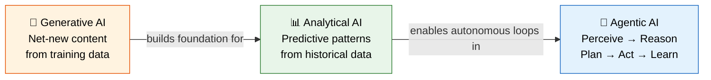
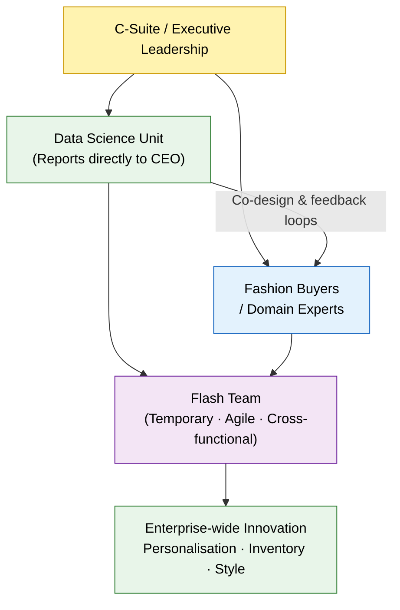
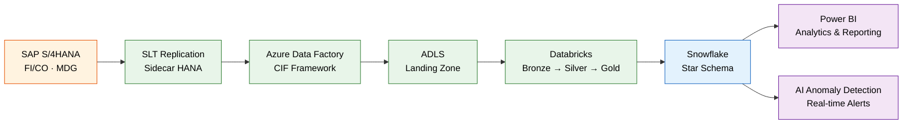
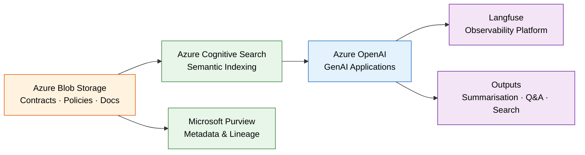
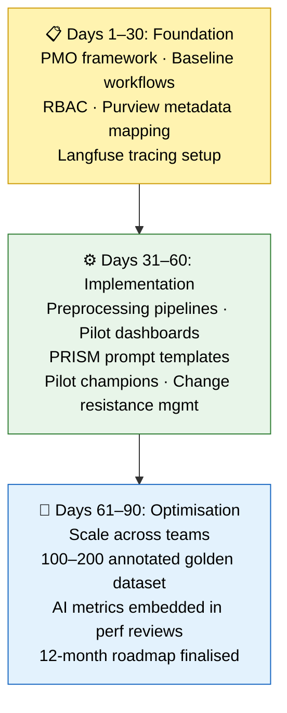

# Executive Brief: Driving AI Transformation Through Strategic Leadership

> *Drawn from the Stanford AI-Driven Leadership Program — covering Stitch Fix, clinical AI failure patterns, enterprise data architecture, and LLM evaluation at scale.*

---

## 1. Navigating the AI Landscape: The Agentic Shift

The Stanford AI-Driven Leadership Program reinforced something I already suspected: organisations that get this right are not treating AI as a static implementation — they are building for continuous adaptation.

This requires understanding the evolving AI continuum:

| Type | What It Does | Primary Input | Output |
|---|---|---|---|
| **Generative AI** | Produces net-new content | Training data patterns | Text, images, code |
| **Analytical AI** | Extracts predictive signals | Historical structured data | Forecasts, classifications |
| **Agentic AI** | Executes continuous decision loops | Live cross-system signals | Autonomous actions |

Scaling these technologies requires a three-part leadership framework:

- **Framing** — aligning initiatives with corporate identity and human empowerment
- **Structuring** — designing workflows, centralising data units, assigning accountability
- **Evaluating** — establishing continuous feedback loops, strict data governance, and clear ROI metrics

---

## 2. Structural Agility: Flash Teams & Organisational Restructuring Adjustments

Real AI capability requires structural transformation — moving away from traditional, siloed hierarchies.



**The Blueprint — Stitch Fix Case Study:** Elevating data science teams to report directly to executive leadership grants them the autonomy to drive enterprise-wide innovation rather than narrow functional goals. This reshapes three dimensions simultaneously:

- **Work practices** — human-machine collaboration and agile experimentation
- **Role relationships** — data scientists and domain experts with real decision authority, working in direct collaboration
- **Organisational networks** — strong cross-functional integration and adaptive decision-making

**The Application — SAP Joule Copilot:** Implementing conversational and transactional tools like SAP Joule is a leadership problem, not a technical deployment. It succeeds by:

1. Framing the tool as **user empowerment**, not replacement
2. Deploying flash teams to accelerate agile development via SAP Build Code
3. Maintaining strict **human-in-the-loop governance** throughout

---

## 3. Workflow Integration: Overcoming the AI Implementation Gap

Technical excellence alone does not guarantee business adoption. MIT Technology Review's analysis of failed clinical pandemic models makes the failure mode concrete: hundreds of published models, none adopted at the bedside. The disconnect was not technical — it was between data teams and operational reality.

> **The core lesson: Treat operational translation as a core design requirement, not an afterthought.**

Leadership must prioritise **process over speed** across two core enterprise data streams:

---

### A. Analytical AI for Financial Operations — Structured Data



| Metric | Current State | Target with AI |
|---|---|---|
| Anomaly detection lag | 24–48 hours | Near real-time |
| Detection accuracy improvement | Baseline | +10–15% |
| Analyst hours saved (close period) | Baseline | ~20 hrs/week |

---

### B. Generative AI & Model Evaluation — Unstructured Data



**The Benchmarking Verdict** — Based on 85 production traces across 6 LLMs in a self-hosted Langfuse environment:

```plotly
{
  "data": [
    {
      "type": "bar",
      "name": "Avg Quality Score",
      "x": ["Claude 4.5 Sonnet", "Claude 4 Opus", "GPT-4o", "Gemini 2.5 Flash", "Llama 3.1 70B", "Mistral"],
      "y": [0.91, 0.89, 0.84, 0.79, 0.68, 0.68],
      "marker": { "color": ["#1565c0","#1976d2","#2e7d32","#f57c00","#6a1b9a","#ad1457"] },
      "text": ["0.91","0.89","0.84","0.79","0.68","0.68"],
      "textposition": "outside"
    }
  ],
  "layout": {
    "title": { "text": "LLM Evaluation: Average Quality Score (85 Traces, Langfuse)", "font": { "size": 16 } },
    "yaxis": { "title": "Avg Score (0–1)", "range": [0, 1.05] },
    "xaxis": { "title": "Model" },
    "plot_bgcolor": "#f9f9f9",
    "paper_bgcolor": "#ffffff",
    "margin": { "t": 60, "b": 80 }
  }
}
```

```plotly
{
  "data": [
    {
      "type": "scatter",
      "mode": "markers+text",
      "name": "Models",
      "x": [0.0045, 0.018, 0.0032, 0.0011, 0, 0],
      "y": [0.91, 0.89, 0.84, 0.79, 0.68, 0.68],
      "text": ["Claude 4.5 Sonnet", "Claude 4 Opus", "GPT-4o", "Gemini 2.5 Flash", "Llama 3.1", "Mistral"],
      "textposition": ["top right","top right","top right","top right","bottom right","bottom left"],
      "marker": {
        "size": [14,12,14,10,10,10],
        "color": ["#1565c0","#1976d2","#2e7d32","#f57c00","#6a1b9a","#ad1457"]
      }
    }
  ],
  "layout": {
    "title": { "text": "Quality vs Cost per 1k Tokens (Langfuse Traces)", "font": { "size": 16 } },
    "xaxis": { "title": "Cost per 1k Tokens (USD)", "tickformat": ".4f" },
    "yaxis": { "title": "Avg Quality Score (0–1)", "range": [0.6, 0.95] },
    "plot_bgcolor": "#f9f9f9",
    "paper_bgcolor": "#ffffff",
    "annotations": [
      {
        "x": 0.0045, "y": 0.91,
        "text": "← Optimal zone",
        "showarrow": false,
        "font": { "color": "#1565c0", "size": 11 },
        "xshift": 60
      }
    ]
  }
}
```

```plotly
{
  "data": [
    {
      "type": "bar",
      "name": "P50 Latency (seconds)",
      "x": ["Claude 4.5 Sonnet", "Claude 4 Opus", "GPT-4o", "Gemini 2.5 Flash", "Llama 3.1 70B", "Mistral"],
      "y": [2.8, 4.1, 2.3, 1.9, 8.2, 8.2],
      "marker": { "color": "#e8f5e9", "line": { "color": "#2e7d32", "width": 1.5 } },
      "text": ["2.8s","4.1s","2.3s","1.9s","8.2s","8.2s"],
      "textposition": "outside"
    }
  ],
  "layout": {
    "title": { "text": "P50 Latency by Model (lower = faster)", "font": { "size": 16 } },
    "yaxis": { "title": "Latency (seconds)", "range": [0, 10] },
    "xaxis": { "title": "Model" },
    "plot_bgcolor": "#f9f9f9",
    "paper_bgcolor": "#ffffff"
  }
}
```

**Model routing recommendation:**

| Use Case | Recommended Model | Rationale |
|---|---|---|
| LLM-as-a-judge / high-stakes eval | **Claude 4.5 Sonnet** | Highest quality (0.91), wins 70%+ head-to-head |
| Bulk generation / cost-sensitive | **GPT-4o** | Strong quality (0.84), lowest hosted cost |
| Rapid experimentation / low-stakes | **Gemini 2.5 Flash** | Fastest latency, lowest cost |
| Full self-hosting / data residency | **Llama 3.1 via Ollama** | Zero token cost, strong isolation |

**Top hallucination mitigation — Retrieval-Augmented Generation (RAG):** Ground every GenAI response in authoritative indexed sources. Feasibility is high given existing Azure Cognitive Search and Purview integration.

---

## 4. The 90-Day Execution Roadmap

| Risk | Control | Phase Applied |
|---|---|---|
| LLM hallucination | RAG grounding via Azure Cognitive Search | Days 31–60 |
| Prompt injection | Query classifiers + adversarial testing | Days 31–60 |
| Model promotion risk | Human-in-the-loop review gate | Days 31–60, 61–90 |
| Data quality drift | Schema enforcement in Databricks Silver layer | Days 1–30 |
| Data access compliance | Unity Catalog + Snowflake RBAC | Days 1–30 |



**Key risk mitigations baked into each phase:**

- **RAG** as the primary hallucination guardrail for text-based GenAI
- **Prompt injection defences** — query classifiers, output guardrails, adversarial testing
- **Human-in-the-loop** review gates before any model is promoted to production
- **Schema enforcement** in the Databricks Silver layer for quantitative flows
- **Unity Catalog + Snowflake RBAC** for SOX/GDPR-sensitive financial data

---

## Reflection: What I Got Right — and What I Missed

What I got right early was recognising the shift toward agentic and analytical workflows before it was obvious. What I missed completely was how much implementation depends on **structural orchestration** — an elite tool deployed into an unreformed org chart delivers almost nothing.

> **The algorithms are the easy part. Data culture, governance, and human-in-the-loop process design are where implementations actually succeed or fail.**

---
