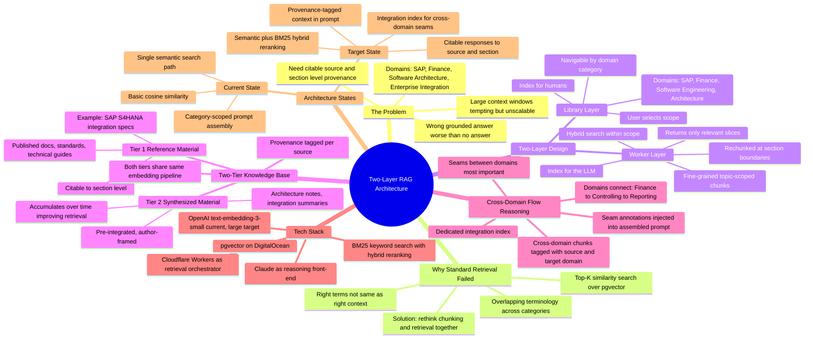
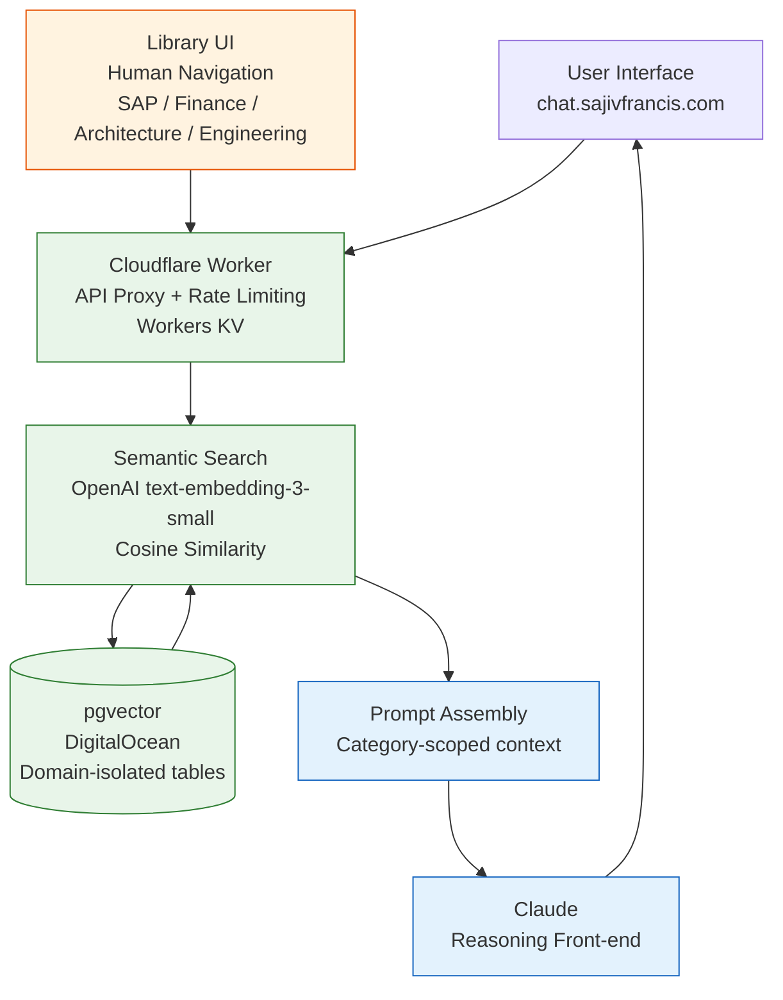
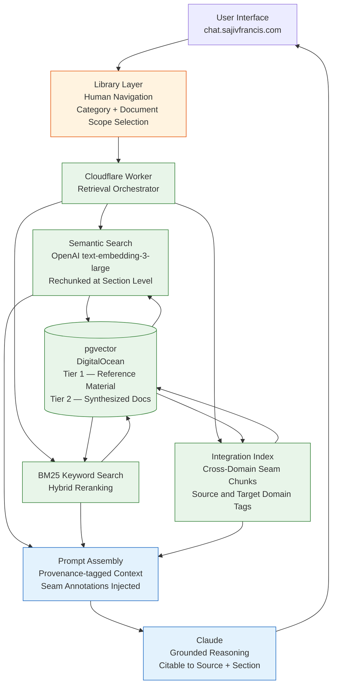

## The Problem With Ingesting Everything

When I first started building my personal chat interface, the instinct was straightforward — give the LLM as much context as possible. Large context
windows made it tempting. Just send the whole document, get a great answer.

It works for one-off queries. But it doesn't scale, and more importantly, it doesn't give you what you actually need from a personal knowledge system:
grounded, citable responses tied to specific sources.

The issue isn't just token cost. Across domains like SAP, finance, software architecture, and enterprise integration, the wrong grounded answer is worse than no answer at all. You need to know exactly where a claim came from — which document, which section, which concept — not just that the LLM produced something plausible.

That realization drove the architecture I'm building now.

---

## Why Standard Retrieval Wasn't Enough

The first attempt used standard top-K similarity search over pgvector. Query gets embedded, cosine similarity finds the nearest chunks, top five go into
the prompt. Straightforward.

The problem: technical domain material has heavily overlapping terminology across categories. Terms that appear everywhere with subtly different meanings
depending on context. A similarity search pulling documents that mention the right terms isn't the same as pulling documents with the right context.

The fix wasn't to abandon retrieval. It was to rethink the chunking and retrieval architecture together.

---

## The Core Insight: Two Separate Layers

The library and the retrieval layer serve different masters.

- **Library** → an index for humans. Navigable, categorized by domain — SAP,Finance, Software Engineering, Architecture, and others. You select scope at the category or document level.
- **Worker** → an index for the LLM. Fine-grained, topic-scoped, automated. Precision retrieval within the scope you selected.

The mistake was storing entire documents as single large chunks. Selecting a category became equivalent to ingesting everything in it. The worker fixes
this re-chunking at natural section boundaries, running hybrid search within scope, and returning only the most relevant slices to the LLM.

The library stays clean for human navigation. What changes is what actually reaches the model.

---

## The Two-Source Knowledge Base

The knowledge base has two tiers.

Tier 1 is reference material — published documents, standards, technical guides organized by domain. High detail, authoritative, citable to section level.

Tier 2 is synthesized material — architecture notes, integration summaries, domain write-ups produced as working artifacts of the research process. High
relevance, pre-integrated, written in the framing I actually use.

Both tiers go through the same embedding and retrieval pipeline. Provenance is tagged so the LLM knows the authority level of each source. The compounding
effect matters: as synthesized documents accumulate, retrieval becomes progressively more aligned to how I think about these domains. The knowledge
base improves with use.

| Tier | Content type | Authority signal | Example |
|------|-------------|------------------|---------|
| 1 — Reference | Published documents, standards, technical guides | Citable to section level | SAP S/4HANA integration specs, finance standards |
| 2 — Synthesized | Architecture notes, integration summaries, domain write-ups | Pre-integrated, author-framed | Cross-domain seam annotations, working notes |

---

## Cross-Domain Flow Reasoning

Domains aren't isolated — they connect. Finance connects to controlling connects to integration connects to reporting. The seams between domains are
where the most important reasoning happens, and they're the least well-represented in any single source document.

The architecture handles this with a dedicated integration index — cross-domain reference chunks tagged with both source and target domain. When
a query spans domains, the worker retrieves from relevant namespaces and injects connection annotations between chunks in the assembled prompt. The LLM
reasons over a coherent flow rather than isolated domain excerpts.

---

## Why Not a Commercial Solution

Commercial RAG platforms trade control for convenience. For general-purpose retrieval that's often the right call. For domain-specific technical reasoning
where chunk quality, cross-domain seams, and provenance metadata are first-class requirements — the custom approach earns its overhead.

The pgvector stack on DigitalOcean combined with Cloudflare Workers for the retrieval layer keeps infrastructure costs low while retaining full control
over chunking strategy, embedding model, hybrid search weighting, and prompt
assembly.

---

## The Architecture: Current and Target State

The diagrams below show how the components connect today, and where the architecture is heading.

### Current State

### Target State

This post documents the architecture behind chat.sajivfrancis.com. Both layers are under active development, the current-state diagram reflects what's running now and the target state is what I'm building toward.
