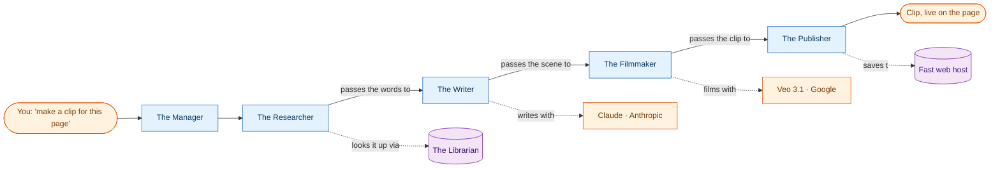

import Figure from '@/components/mdx/Figure.astro';

As part of this build, the little videos quietly looping at the top of [the home page](/) and the [about page](/about/)? were not made with a video editor. I did not make them at all, instead, a handful of small AI programs did by passing the tasks down a kitchen line. One grabs from a particular page's own words, one writes a scene, one films it, one puts it online.

I had two reasons for building this, one more useful than the other. The useful one: everybody in tech is suddenly talking about how AI tools should *coordinate* with each other, hence, I wanted to build a prototype than read about it elsewhere. The other reason: the site needed videos and I really didn't feel like making them by spending time.

So here's how the AI & Automation crew works in layman terms without any technical jargon along with the roadblocks faced during the build.

## The whole idea, in two pictures

Two ideas do most of the work here and each has a name the industry likes to throw around, Here's a simpler way to understand:

- **A Librarian.** You ask and it instantly hands back the right page from a big shelf of notes. This is the piece we call **MCP** (short for Model Context Protocol).
- **A relay team.** A few specialists passing a job down the line where each one does their part, then taps the next one on the shoulder. This is the **A2A** side of things (agent-to-agent).

The interesting thing isn't the names, it's the *pace*. The Librarian's response is instant while the relay team is more like "leave it with me, check back later." That gap turned out to be the whole point of the exercise.

Fun facts: these two ideas didn't come from the same place while **MCP** was introduced by **Anthropic** — the company behind Claude and **A2A** came from **Google** — the company behind Gemini and Veo. Which is a fun coincidence here, because my little crew ends up using one model from *each* of them: Claude does the writing, and Google's Veo does the filming. Two rival labs, quietly collaborating inside my website without being asked.

## Meet the crew

Five helpers, one job each, passing the work down the line:

<small>The Manager kicks things off, then the work travels down the line — each helper hands its result to the next. The dotted lines are the outside tools each one leans on.</small>

The **Researcher** asks the Librarian what the page actually says. The **Writer** turns that into a short, 8-second scene — calm, cinematic, no narration, no people — using **Anthropic's Claude**. The **Filmmaker** hands that scene to **Google's Veo 3.1** and waits. The **Publisher** grabs the finished clip, drops it on a fast web host, and hands back the link. One request in, one video out.

## Watch one get made

This is the part I find satisfying because most of the steps blink by in seconds and then it just *sits there* on the filming step, politely checking "done yet? …done yet?" for a solid minute while the video renders. That isn't a bug because filming takes time, so the crew is built to drop the job off and check back, instead of standing around holding the phone.

<Figure
  src="/video/n8n-live-run.mp4"
  video
  caption="The crew running, start to finish. The quick steps fly past; then it parks on the Filmmaker, asking 'done yet?' over and over while the clip renders."
/>

## How long each part actually takes

Here's a real run that was timed:

| Step | What happens | Time |
|---|---|---|
| **Research** | the Librarian hands back the page's words | under a second |
| **Writing** | the AI writes the 8-second scene | 6 seconds |
| **Filming** | the AI renders the video *(the slow one)* | **1 minute** |
| **Publishing** | save the clip, put it online | about a second |
| **Start to finish** | request → video live on the site | **75 seconds** |

## And then I lost a day to a dashboard

Here's the confession. The AI parts? Are they Smooth? Almost suspeciusly is the thought, however, the thing that ate a full day was the *dashboard* with a tool called **n8n** that I used to watch the crew work, so I could see each hand-off happen live.

<Figure
  src="/img/n8n-pipeline-run.png"
  alt="A dashboard showing the whole crew's run completed, every step marked done in green"
  caption="The dashboard once it finally behaved: the quick lookup on the left, then each helper handing off to the next, all green."
/>

The issue was because I was running a *newer* version of n8n than my setup was written for, this caused issues where I'd fix one mismatch and the next would pop up right behind it.

Once I pinned the dashboard to one version and adjusted the workflow json file, the n8n dashboard came up clean too.

If you take one thing from all this: the AI was the easy part. The tools *around* the AI were the harder things to configure. Pin your versions and always check your work.

## What's next

The reason I built it as a reusable crew instead of a one-off: I want to point the **Filmmaker** at a different kind of model, a talking-avatar one where the same five helpers turn my *written posts* into short "watch video type" summaries because the Writer already knows how to write the longer script while nothing else needs to be changed in the pipeline.

For now, the experiment worked while the auto-generated videos are [on the site now](/). The next batch should explain the writing itself, ideally. 😄
