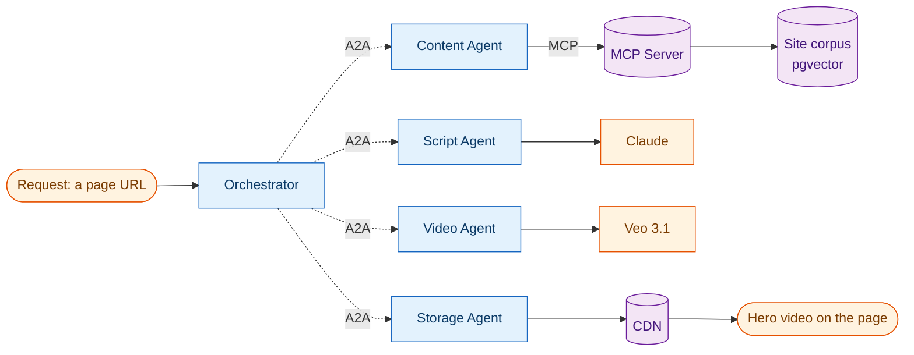
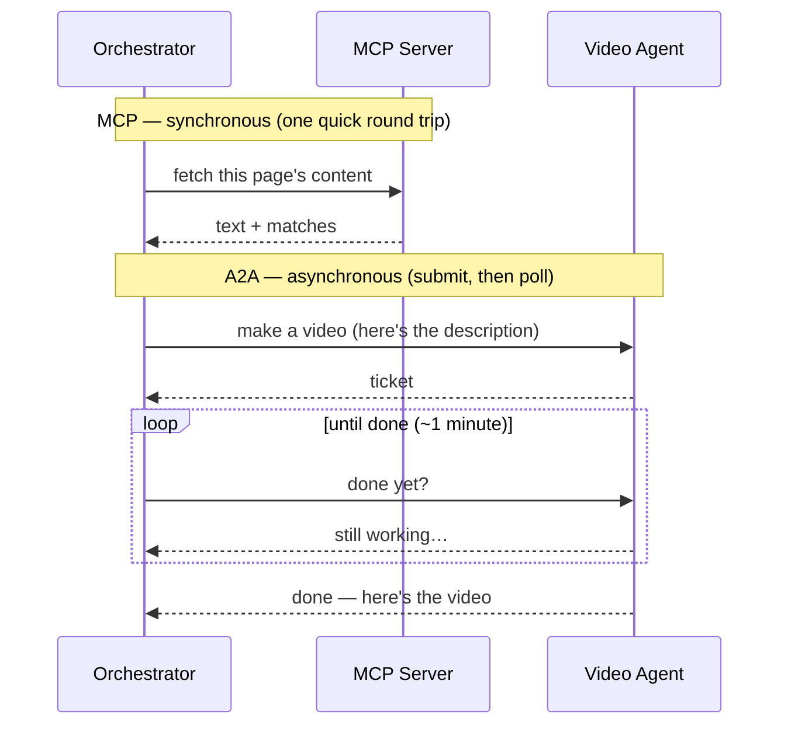

The short cinematic clips at the top of [the home page](/) and the [about page](/about/) weren't made in a video editor. They were made by a small team of AI *agents* that talk to each other — fetching the page's own words, writing a shot description, rendering it, and publishing it to a CDN — with no human in the loop after the first request.

I built it for two reasons. The honest one: I wanted a real, low-stakes job to test two protocols that everyone in the AI world is suddenly talking about — **A2A** and **MCP** — instead of reading about them. The useful one: the site needed videos, and this is the same machinery I'll later point at writing and docs to produce walkthrough videos.

This is the story of how it works, in plain language, and what went wrong along the way.

## The two protocols, without the jargon

Two acronyms do all the heavy lifting. Here's the whole idea in one sentence each:

- **MCP (Model Context Protocol)** is a **librarian**. You ask it a question, it reaches into a knowledge store and hands back the relevant material — *right now*, in one quick round trip.
- **A2A (Agent-to-Agent)** is a **team of specialists**. One agent hands a job to another, gets back a ticket, and checks on it until it's done. The specialists don't need to know how each other work — just how to hand off work and report status.

The interesting part — which I'll come back to with real numbers — is that these two have completely different *rhythms*. MCP is a quick lookup. A2A is submit-a-job-and-wait. Seeing that difference in practice is most of what made the exercise worth doing.

## The team

Five agents, each with one job, plus a knowledge store and a CDN:

The **Orchestrator** is the project manager. It doesn't do the work; it delegates, in order:

1. **Content Agent** — asks the *librarian* (MCP) for the page's own text from the site's knowledge store.
2. **Script Agent** — hands that text to Claude and gets back an 8-second cinematic *shot description* (no narration, no people — a silent background loop).
3. **Video Agent** — sends that description to Google's Veo model and waits for the render.
4. **Storage Agent** — downloads the finished clip and uploads it to the CDN, returning the final URL.

Each arrow marked **A2A** is one agent handing a job to another. The single arrow marked **MCP** is the quick librarian lookup.

## How one video gets made

Here's a single run, and this is where the two rhythms show up. Watch how the MCP call returns immediately, while the A2A video job is *submit-and-poll* — the Orchestrator keeps asking "done yet?" for a minute while Veo renders:

<figure>
  <video src="/video/n8n-live-run.mp4" controls muted playsinline preload="metadata" style="width:100%;border-radius:8px;border:1px solid var(--color-border)"></video>
  <figcaption>The pipeline running live in n8n: the MCP lookup finishes in seconds, then the Video Agent's poll loop cycles for minutes while Veo renders — the two rhythms, on screen.</figcaption>
</figure>

That contrast *is* the lesson. A librarian lookup and a video render are fundamentally different shapes of work, and the two protocols are shaped to match: MCP for "give me context, now," A2A for "go do this longer job and I'll check back."

## The numbers from a real run

This isn't hand-wavy — here's an actual end-to-end run, measured step by step:

| Stage | What happens | Time |
|---|---|---|
| **Content** (MCP) | librarian returns the page text (3 matches) | sub-second |
| **Script** (A2A → Claude) | writes the 8-second shot description | **5.7 s** |
| **Video** (A2A → Veo) | renders the clip *(the long pole)* | **61 s** |
| **Storage** (A2A → CDN) | download + upload | 0.8 s + 0.15 s |
| **End-to-end** | request → published video | **~75 s** |

One picture's worth of insight: **the render dominates everything else by an order of magnitude.** That's exactly why the video step is built as an asynchronous A2A job you poll, not a call you wait on — and why the fast MCP lookup is a separate, synchronous shape. The architecture mirrors the physics of the work.

<figure>
  
  <figcaption>A completed run in n8n: the MCP lane (left) returns the page's context, then the A2A agents — Script → Video → Storage — each hand off and report status until the clip is published.</figcaption>
</figure>

## What went wrong (the honest part)

The agents and the protocols were the *easy* part. The hard part was the visibility layer.

I wanted a live dashboard of the whole flow — every hand-off, every status, the context being pulled — so I wired the pipeline into [n8n](https://n8n.io/), a visual workflow tool. That's where I lost a day.

The root cause was a single, unglamorous mistake: I ran n8n as `:latest` and tried to import a workflow that was authored for an older version. Every layer had quietly changed between versions — how the tool *activates* a workflow, what each building block's settings are called, even the import format. Fixing one mismatch surfaced the next. It was death by a thousand small incompatibilities.

What got me out of it was stepping back and asking the right question — not "how do I fix this error?" but "what's the discipline that prevents *all* of these?"

| What bit me | The discipline that fixes it |
|---|---|
| Ran the tool as "latest" | **Pin the exact version** (down to the digest). Stateful tools should never float. |
| Hand-edited the workflow file | **Build it in the tool, then export.** Let the tool write its own config; never reverse-engineer it by hand. |
| Let a *nice-to-have* block a *done* deliverable | **Separate "it works" from "I can watch it work."** The pipeline worked the whole time; only the dashboard was broken. |
| No stopping rule | **Timebox integration spikes.** "If the visualization isn't cooperating in N tries, capture the same data another way." |
| Leaned on a GUI for proof | **Prefer evidence you control.** A 120-line script that speaks the same protocols gives reproducible numbers — better proof than screenshots. |

That last one is how I actually got the numbers in the table above: a small script that talks A2A and MCP directly and records the timings. It's version-proof and rerunnable — and it made the dashboard optional instead of critical. (Once I pinned the version and exported the workflow properly, the dashboard came up clean too. Both now work; only one is load-bearing.)

If there's a single takeaway for anyone wiring up agent tooling: **the protocols are stable and pleasant; the tools around them drift. Pin your versions, and keep a way to get your evidence without the GUI.**

## What's next

Phase 1 is the reason the plumbing is generic. The same five agents, with the Video Agent pointed at an avatar/talking-head model instead of Veo, will turn the *writing and docs* on this site into short walkthrough videos — a summary you can watch instead of read. The Script Agent already knows how to write the longer narration; nothing else has to change.

The protocols did their job. The videos are real, they're [on the site now](/), and the next batch will explain the writing itself.
