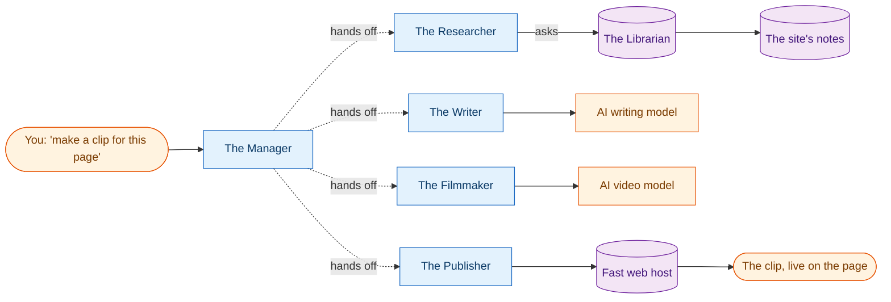
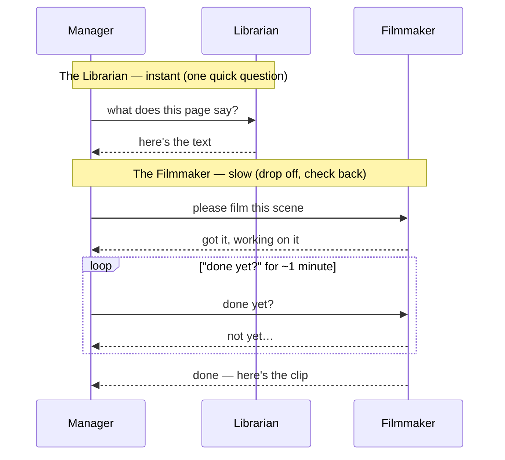

import Figure from '@/components/mdx/Figure.astro';

The short, looping videos at the top of [the home page](/) and the [about page](/about/) weren't made by me in a video app. They were made by a small crew of **AI helpers that pass work to each other** — one fetches the page's own words, one writes a scene, one films it, and one publishes it — with nobody touching it after the first "go."

I built it for two reasons. The honest one: everyone in tech is suddenly talking about two new ways for AI tools to coordinate, and I wanted to *actually use* them on a real job instead of just reading about them. The practical one: the site needed videos, and this same little crew will later make short "watch instead of read" clips for my writing.

Here's how it works — no technical background needed — and the very human snag I hit in the middle.

## The whole idea, in two sentences

Two buzzwords do all the work here. You can forget the names and just remember the pictures:

- **The Librarian.** You ask a question, and it instantly hands back the right material from a big shelf of notes. *(Techies call this "MCP." You can ignore that.)*
- **The Relay Team.** A group of specialists who pass a job down the line — each does their one thing and tells the next person it's ready. *(Techies call this "A2A.")*

The fun part — and the reason this was worth doing — is that these two have very different *speeds*. The Librarian is instant. The Relay Team is "drop off the job and come back later." Watching that difference in real life is most of the lesson.

## Meet the crew

Five helpers, each with exactly one job:

<small>The Manager doesn't do the work — it just hands each job to the right helper, in order.</small>

1. **The Researcher** asks the **Librarian** for the page's own words.
2. **The Writer** turns those words into a short, 8-second *scene description* — a calm, cinematic background loop, no narration, no people.
3. **The Filmmaker** sends that description to an AI video model and waits for it to render.
4. **The Publisher** takes the finished clip and puts it on a fast public web host, then hands back the link.

That's it. One request in, one video out.

## Watch one video get made

This is where the two speeds show up. Notice how the Librarian answers *instantly*, but the Filmmaker is "drop it off and keep checking back" — the Manager literally asks "done yet?" over and over for a minute while the video renders:

<Figure
  src="/video/n8n-live-run.mp4"
  video
  caption="The crew working, live. The quick steps fly by in seconds; then it sits on the Filmmaker step, politely asking 'done yet?' over and over while the video renders. That waiting is the whole point."
/>

That contrast *is* the lesson. Looking something up and filming something are completely different kinds of work — one is instant, one takes minutes — so the crew is built to match: ask-and-wait for the quick stuff, drop-off-and-check-back for the slow stuff.

## How long each part actually takes

This isn't hand-wavy — here's a real run, timed step by step:

| Step | What happens | Time |
|---|---|---|
| **Research** | the Librarian hands back the page's words | under a second |
| **Writing** | the AI writes the 8-second scene | ~6 seconds |
| **Filming** | the AI renders the video *(the slow part)* | **~1 minute** |
| **Publishing** | save the clip, put it online | about 1 second |
| **Start to finish** | request → finished video on the site | **~75 seconds** |

The one thing to take away: **the filming step dwarfs everything else.** That's exactly why it's the "drop off and check back" kind of job, while the quick lookup is the "ask and get an instant answer" kind. The design simply matches reality.

<Figure
  src="/img/n8n-pipeline-run.png"
  alt="A dashboard showing the whole crew's run completed, every step marked done in green"
  caption="A finished run on the dashboard I used to watch the crew work: the quick lookup on the left, then each helper handing off to the next until the clip is published."
/>

## The part that actually went wrong

The AI helpers were the *easy* part. The headache was the **dashboard** — the screen above, which lets me watch every hand-off as it happens. I wanted that view, so I plugged the crew into a popular visual dashboard tool. That's where I lost a day.

The cause was almost embarrassingly ordinary: **I was using a newer version of the dashboard tool than the setup was written for.** Imagine buying a piece of furniture and using last year's instruction booklet — the parts are *almost* the same, but every few steps a screw is named differently and a panel faces the other way. Fixing one mismatch just revealed the next.

<Figure
  src="/img/n8n-pipeline-run-before.png"
  alt="An early run on the dashboard that did not work — steps not completing properly"
  caption="Before: an early attempt. It looked like it ran, but the steps weren't really connecting — the equivalent of the assembly line moving with nothing on the belt."
/>

<Figure
  src="/img/n8n-pipeline-run-after.png"
  alt="The same dashboard run working end to end, every step green"
  caption="After: once I matched the versions and stopped hand-editing the setup, the same run completed cleanly — every helper doing its job, in order."
/>

What got me unstuck wasn't fixing errors one by one — it was stepping back and asking the better question: *what habit would have prevented all of these at once?* Here's what I landed on, in plain terms:

| What tripped me up | The habit that fixes it |
|---|---|
| I used whatever the "latest" version was | **Lock to one exact version** and stick with it — don't let the ground move under you. |
| I edited the setup file by hand | **Let the tool build its own setup, then save it** — don't reverse-engineer it yourself. |
| A "nice to have" blocked a finished job | **Keep "it works" separate from "I can watch it work."** The crew worked the whole time; only the viewing screen was broken. |
| I kept poking at it with no stopping point | **Give yourself a time limit** — "if the dashboard won't behave in an hour, get the proof another way." |
| I leaned on the dashboard for proof | **Keep a simple backup way to check your results** that doesn't depend on the fancy tool. |

That last habit is how I got the real timings above: a tiny script that talks to the crew directly and writes down how long each step took — boring, reliable, and version-proof. Once I also locked the dashboard to one version, *it* came up clean too. Now both work; only one is essential.

If there's one line to take from all this: **the AI parts were stable and pleasant; the tools around them were the fussy bit. Pick one version, stick to it, and always keep a simple way to check your work.**

## What's next

The whole point of building it as a reusable crew is what comes next: point the **Filmmaker** at a different kind of AI model — a talking-host one — and the same five helpers will turn my *written posts* into short "watch instead of read" summaries. The Writer already knows how to write the longer narration; nothing else has to change.

The experiment worked. The videos are real, they're [on the site now](/), and the next batch will explain the writing itself — hopefully in plain English, too. 😄
