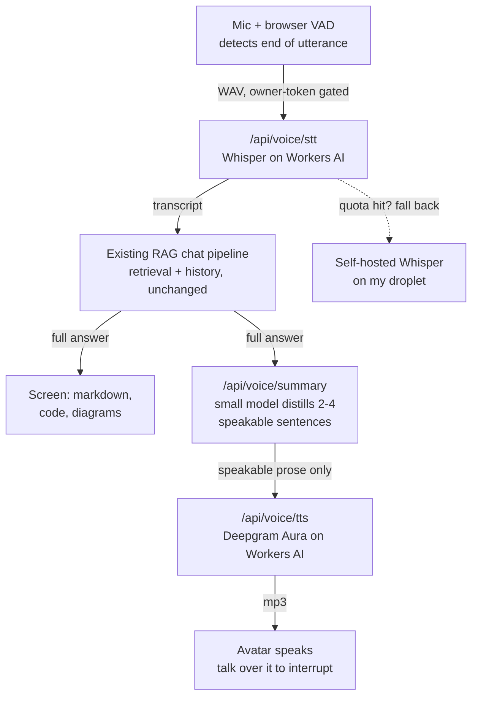

My personal chat at [chat.sajivfrancis.com](https://chat.sajivfrancis.com) can now talk to me.

Tap the avatar in the corner, ask a question out loud, and the full answer appears on screen — including code, diagrams, and citations — while the avatar speaks a shorter, conversational version.

It started as a simple experiment. I asked ChatGPT to create two illustrated people for my About page, and these were the result:

The female portrait became the live voice avatar; her counterpart is in the repo for a future avatar picker.

## The architecture

The key decision was to make voice **a mode of the existing chat, not a separate bot**.

A spoken question follows exactly the same pipeline as a typed one: transcription → existing RAG/retrieval + chat history → full answer. Nothing in the existing RAG stack needed to change.

The full response is rendered normally on screen. A small model then turns it into 2–4 sentences of conversational prose, which goes through TTS.

That also solves a surprisingly important problem: **the voice never reads code at you.**

Rather than trying to strip Markdown, diagrams, and code from the original answer, I generate a separate response specifically designed to be spoken.

Browser-side Silero VAD detects when I've stopped talking, so there's no push-to-talk. Speaking over the avatar interrupts playback. The voice endpoints are provider-agnostic, which also made it easy to add fallbacks.

## The pricing lesson

Everything initially ran on Cloudflare Workers AI — Whisper for transcription and Deepgram Aura for TTS. I thought the free allocation would comfortably cover personal testing. It did not.

I had misread the billing units by three orders of magnitude:

|                       | What I assumed                   | What it actually was                    |
| --------------------- | -------------------------------- | --------------------------------------- |
| TTS billing rate      | ~2.7 neurons per 1,000 characters | ~2.7 neurons per **character**          |
| Free daily allocation | 10,000 neurons                   | 10,000 neurons                          |
| TTS characters/day    | ~3,600,000                       | ~3,700 (≈ a dozen spoken replies)       |

The result, mid-testing: `AiError 4006: daily free allocation exhausted`.

Fortunately, I already had faster-whisper running on my own droplet, so I added it as a transcription fallback. I also added visible failure states to the avatar — a voice interface should never silently fail and pretend it didn't hear you.

## What's next

This version is deliberately turn-based: speak → wait → listen. The next iteration is about making it feel like a real conversation:

- **Streaming transcription + turn detection** instead of batch VAD → Whisper.
- **Sentence-chunked TTS**, so the avatar starts speaking before the entire answer is finished.
- **A stateful WebSocket session** using a Durable Object, including true server-side barge-in that can cancel generation.
- **A realtime bake-off** between this componentized architecture and native speech-to-speech models such as xAI's `grok-voice`.
- **Lip-sync**, using Aura's word-level timestamps.

The bigger lesson for me is that a personal site is a great place to run these experiments.

It's low stakes. I can try new models, discover pricing mistakes, swap providers, measure latency, and learn what actually works — then carry the useful architecture into projects where it matters.
