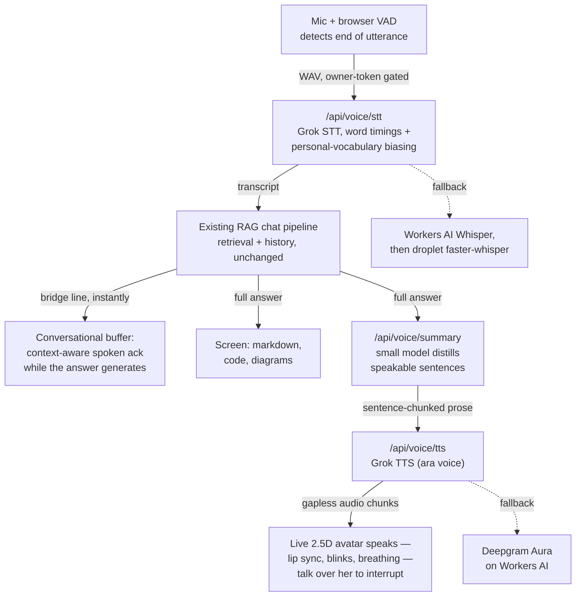

My personal chat at [chat.sajivfrancis.com](https://chat.sajivfrancis.com) can now talk to me.

Tap the avatar in the corner, ask a question out loud, and the full answer appears on screen — including code, diagrams, and citations — while the avatar speaks a shorter, conversational version.

*Updated 2026-08-22: the audio pipeline has since moved to Grok as its primary provider, the turn-based loop became a real conversation, and the static portrait became a live 2.5D figure — this post now describes the current architecture.*

It started as a simple experiment: I asked an image model to illustrate a persona for my site, and Maya was the result.

She is now the site's single mascot: the landing page, the docked voice avatar, and the animated full-body view all derive from this one image, so she looks the same wherever you meet her. (A male counterpart waits in the repo for a future avatar picker.)

## The architecture

The key decision was to make voice **a mode of the existing chat, not a separate bot**.

A spoken question follows exactly the same pipeline as a typed one: transcription → existing RAG/retrieval + chat history → full answer. Nothing in the existing RAG stack needed to change.

The full response is rendered normally on screen. A small model then turns it into 2–4 sentences of conversational prose, which goes through TTS.

That also solves a surprisingly important problem: **the voice never reads code at you.**

Rather than trying to strip Markdown, diagrams, and code from the original answer, I generate a separate response specifically designed to be spoken.

Browser-side Silero VAD detects when I've stopped talking, so there's no push-to-talk. Speaking over the avatar interrupts playback — a real barge-in that cancels generation server-side, not just muted audio.

Every audio primitive sits behind a **provider chain** rather than a single vendor. Grok is the primary for both directions — its STT returns word timings and accepts key-term biasing for my personal vocabulary, and its TTS (Maya speaks in the `ara` voice) streams with low first-byte latency — with Workers AI (Whisper, Deepgram Aura) as the on-stack fallback and self-hosted faster-whisper on my droplet as the always-available last resort. No key, no problem: without the Grok key the chain simply behaves like the original Workers AI build.

Two things in that diagram didn't exist in the first version of this post. The **conversational buffer** speaks a fresh, topic-aware bridge line the moment your question is understood ("Pulling up the order-to-cash flow — one sec") instead of dead air, then hands off to the real answer as sentence-chunked, gapless TTS. And the avatar herself is no longer a static portrait: a small WebGL engine renders her from a two-layer depth package — she breathes, blinks, shifts her weight, and lip-syncs to the audio level while speaking.

## The pricing lesson

Everything initially ran on Cloudflare Workers AI — Whisper for transcription and Deepgram Aura for TTS. I thought the free allocation would comfortably cover personal testing. It did not.

I had misread the billing units by three orders of magnitude:

|                       | What I assumed                   | What it actually was                    |
| --------------------- | -------------------------------- | --------------------------------------- |
| TTS billing rate      | ~2.7 neurons per 1,000 characters | ~2.7 neurons per **character**          |
| Free daily allocation | 10,000 neurons                   | 10,000 neurons                          |
| TTS characters/day    | ~3,600,000                       | ~3,700 (≈ a dozen spoken replies)       |

The result, mid-testing: `AiError 4006: daily free allocation exhausted`.

Fortunately, I already had faster-whisper running on my own droplet, so I added it as a transcription fallback. I also added visible failure states to the avatar — a voice interface should never silently fail and pretend it didn't hear you.

That pricing lesson is also what reshaped the architecture above: at roughly $4.20 per million characters, Grok TTS costs about a dollar a month at heavy personal use, so it became the primary provider — implemented as a chain rather than a swap, which is why the free-tier fallbacks survive as resilience instead of dead code.

## What's next

The first version of this list said "make it feel like a real conversation" — sentence-chunked TTS, server-side barge-in, a conversational mode. Those shipped, along with the live 2.5D avatar. What's still ahead:

- **Full-duplex streaming** — Grok's WebSocket STT with `smart_turn` end-of-turn detection, replacing batch VAD → transcribe entirely.
- **Word-timestamp lip-sync** — Grok TTS already returns word timings; the engine currently syncs to audio level.
- **A true 3D Maya** — the current avatar is a 2.5D depth mesh built from one image. The end state: a background-free 3D figure speaking *over the page itself*, the website as her backdrop rather than a painted one.

The bigger lesson for me is that a personal site is a great place to run these experiments.

It's low stakes. I can try new models, discover pricing mistakes, swap providers, measure latency, and learn what actually works — then carry the useful architecture into projects where it matters.
